# Guía de Hardening de un Router

## Introducción

En el mundo conectado actual, los routers juegan un papel crítico en la seguridad de la red doméstica o empresarial. Asegurar adecuadamente estos dispositivos es esencial para proteger la privacidad y la integridad de los datos transmitidos a través de la red. En esta guía, llevaremos a cabo el proceso de hardening de un router específico, el [pcWRT](https://demo.pcwrt.com/), utilizando una lista de verificación proporcionada por [routersecurity.org](https://routersecurity.org/checklist.php). Esta lista ofrece pautas universales y esenciales que todo router debe cumplir para garantizar un nivel de seguridad óptimo.

## Índice

- [Pasos](#pasos)
    - [WPS](#wps)
    - [Contraseñas por defecto](#contraseñas-por-defecto)
    - [Administración local](#administración-local)
    - [Administración remota](#administración-remota)
    - [Cuentas de fabricante](#cuentas-de-fabricante)
    - [DNS Seguro](#dns-seguro)
    - [El router te espía](#el-router-te-espía)
    - [Firewall](#firewall)
    - [VLANs](#vlans)
    - [WiFi](#wifi)
    - [Redes WiFi ocultas](#redes-wifi-ocultas)
    - [WPA2](#wpa2)
    - [Redes de invitados](#redes-de-invitados)
    - [UserID del Router](#userid-del-router)
    - [Contraseña de Admin del Router](#contraseña-de-admin-del-router)
    - [Filtrado por dirección MAC](#filtrado-por-dirección-mac)
    - [UPnP](#upnp)
    - [Port Forwarding](#port-forwarding)
    - [BackUp de los ajustes](#backup-de-los-ajustes)
    - [Firmware](#firmware)
    - [Firmware auto-actualizable](#firmware-auto-actualizable)
    - [Bloqueo de acceso al módem mediante IP](#bloqueo-de-acceso-al-módem-mediante-ip)
    - [Logging](#logging)
    - [Email](#email)
    - [DDNS](#ddns)
    - [Monitoreo de dispositivos adjuntos](#monitoreo-de-dispositivos-adjuntos)
    - [Uso compartido de archivos de dispositivos de almacenamiento conectados a un puerto USB](#uso-compartido-de-archivos-de-dispositivos-de-almacenamiento-conectados-a-un-puerto-usb)
    - [Acceso a la interfaz web](#acceso-a-la-interfaz-web)
    - [Ocultamiento de SSID](#ocultamiento-de-ssid)
    - [Falla de seguridad "Misfortune Cookie"](#falla-de-seguridad-misfortune-cookie)
    - [Apps de Smartphone](#apps-de-smartphone)
    - [Notificación de dispositivo nuevo](#notificación-de-dispositivo-nuevo)
    - [Dispositivos recientes](#dispositivos-recientes)
    - [Reseteo de fábrica](#reseteo-de-fábrica)
    - [HNAP](#hnap)

## Pasos

### WPS

El router pcWRT no soporta el método de conexión WPS, que es considerado bastante inseguro. En caso de soportar dicho método, este debería desactivarse, dado que si no, cualquiera podría garantizar un acceso rápido y fácil al router.

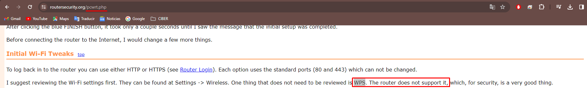

### Contraseñas por defecto

Las contraseñas por defecto suponen un gran problema de seguridad en cualquier router, y es por ello que necesitamos cambiarla. Para ello accederemos a la pestaña _Settings_ y a _System_, y en el apartado _Administration_ hacemos clic en _Change Router Password_. Allí introducimos una contraseña segura, como por ejemplo, la siguiente: **I{l8qe|oGPwnOM52@\C;**. Esta ha sido generada por la página [clavesegura](https://www.clavesegura.org/es/).

### Administración local

[...]

### Administración remota

[...]

### Cuentas de fabricante

[...]

### DNS Seguro

[...]

### El router te espía

[...]

### Firewall

[...]

### VLANs

Las VLAN nos permiten dividir la red WiFi de su Router en secciones departamentadas y aisladas, lo que redunda en beneficio de su seguridad. Para lograr esto tenemos primero que crear subredes dentro de nuestro Router, lo cual logramos accediendo a la pestaña _Settings_ y a _Wireless_. Una vez allí, en el apartado _WiFi Networks_ haremos clic en el icono con un **+**, y añadiremos la subred, en nuestro caso, la de invitados (*Guest*).

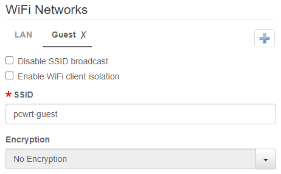

Luego vamos a _Settings_ y a _Network_, donde buscaremos la sección _VLAN_. Allí activaremos el puerto 1, y lo asignaremos a la subred _Guest_. Luego, en el panel de abajo, veremos que a la izquierda se encuentran las subredes de origen, mientras que arriba están los dispositivos de destino de **cada subred**, de modo que nos cercioraremos que los dispositivos de la subred _Guest_ accedan sólo a los que estén dentro la misma, y no a otros ubicados en otras subredes.

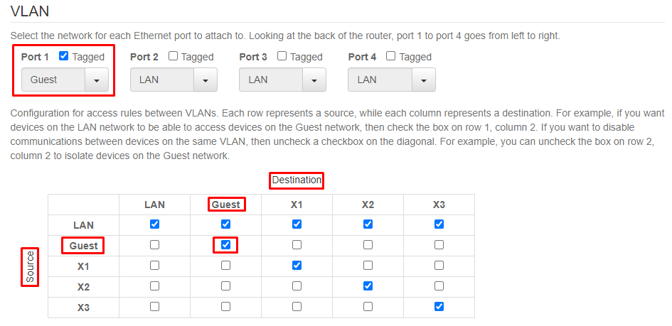

### WiFi

Una buena opción para lograr securizar nuestra red es poder dessactivar el WiFi cuando no lo necesitemos, y esta es precisamente una opción que el Router pcWRT ofrece. Para ello nos dirigiremos a _Settings_ y a _Wireless_. 

Luego, tan sólo tendremos que oprimir el botón Disable, en el cuadro verde con el texto _Wireless Network is enabled_, para poder deshabilitar nuestro WiFi.

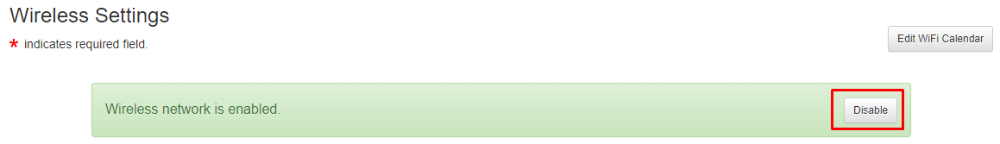

Si queremos, también podemos limitar el horario en el cual, la red WiFi esté operativa, y para ello sólo tendremos que pulsar el botón _Edit WiFi Calendar_, justo encima y a la derecha del cuadro verde anteriormente mencionado. Después, seleccionaremos la opción _Limited Time_, y estableceremos el horario en el que deseemos hacer uso de nuestro WiFi.

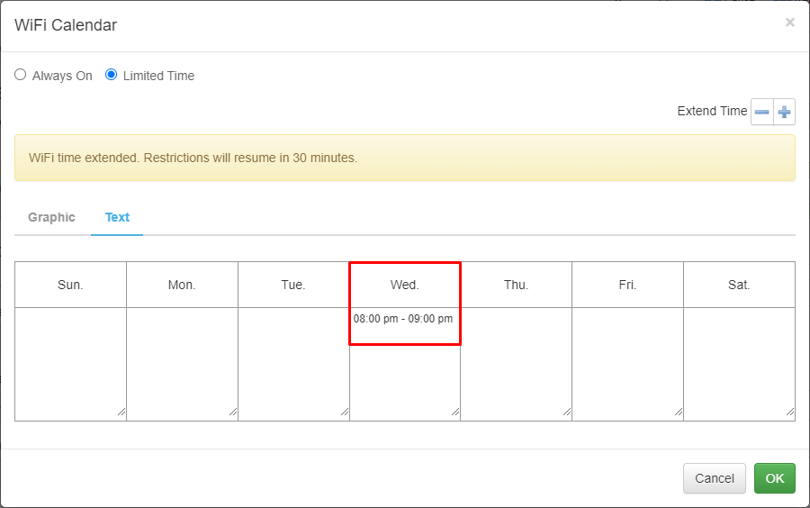

### Redes WiFi ocultas

Algunos routers incorporan la capacidad de crear redes WiFi ocultas, lo que puede mejorar la seguridad de la misma hasta cierto punto. El router pcWRT contiene la opción _Disable SSID Broadcast_, que hace invisible nuestra red WiFi para la mayoría de ciberdelincuentes menos experimentados. 

El problema con esto es que los atacantes can más experiencia y conocimientos [aún serán capaces de encontrar nuestra red](https://www.pcwrt.com/2017/11/five-wifi-security-settings-and-their-effectiveness-in-securing-your-wifi-network/). De todas formas, esta medida mantendrá a la mayoría de ciberdelincuentes alejados de nuestra privacidad, y para ello seleccionaremos la pestaña _Settings_ y _Wireless_. Luego, en la sección _WiFi Networks_, activaremos la opción _Disable SSID broadcast_.

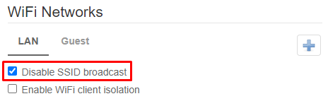

### WPA2

Aunque muchos routers incluyen el protocolo de encriptación WPA2 junto con la clave precompartida PSK, otros tan sólo disponen de la opción compartida WPA/WPA2, la cual no es tan segura. Luego, también se ofrecen algoritmos de cifrado, para mayor seguridad, como el AES o CCMP, aunque existen otros como el TKIP, que no es tan seguro.

En nuestro router pcWRT, escogeremos la opción WPA2-PSK, y para ello navegaremos por las pestañas _Settings_ y _Wireless_, y en la sección _WiFi Networks_, elegiremos la susodicha opción del desplegable _Encryption_. Después de hacer esto, escogeremos el algoritmo de cifrado CCMP (AES). Finalmente, introduciremos una contraseña para nuestra red, y para esto recomendamos la página web [clavesegura](https://www.clavesegura.org/es/).

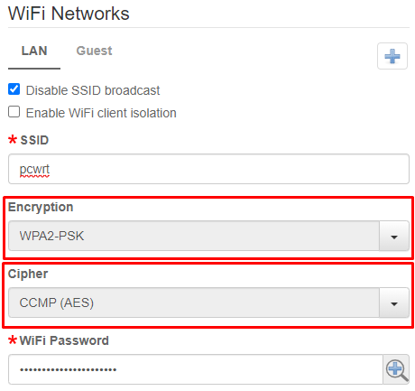

### Redes de invitados

Las redes de invitados que muchos routers ofrecen redundan en beneficio de la seguridad de su red, dado que eliminan la necesidad de dar a terceros la clave de su red WiFi. Además, como se explica en el apartado [VLANs](#vlans), podemos aislar esta red del resto de dispositivos de la red WiFi principal, haciendo esta opción aún más segura.

Dado que esto se explica a detalle en el apartado de las VLAN, nos referimos a este para que pueda seguir los pasos para crear una subred de invitados.

### UserID del Router

[...]

### Contraseña de Admin del Router

[...]

### Filtrado por dirección MAC

El filtrado por dirección MAC nos puede permitir elegir quienes pueden conectarse a nuestra red, o por el contrario, quienes no podrán hacerlo. Para activar este filtro, nos dirigiremos a _Settings_ y _Wireless_, y en la sección _MAC Filter_ haremos clic en el desplegable _MAC Address Filter_, donde optaremos por crear una _White List_ o lista blanca de direcciones MAC que podrán conectarse a nuestra red. Luego, tan sólo tendremos que escribir las MAC de los dispositivos que autorizaremos a conectarse.

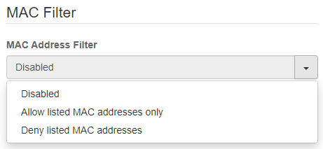

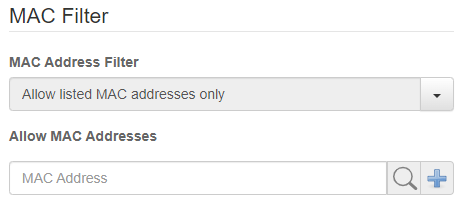

### UPnP

El protocolo Universal Plug and Play (UPnP) es considerado inseguro, por lo que nos aseguraremos que en nuestro router pcWRT esté deshabilitado. Para ello iremos a _Apps_ y a _UPnP_, donde veremos que, efectivamente, el protocolo en cuestión está deshabilitado por defecto.

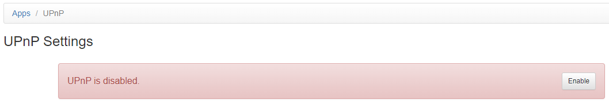

### Port Forwarding

[...]

### BackUp de los ajustes

[...]

### Firmware

El router pcWRT posee una opción para recibir notificaciones en caso que existan actualizaciones del firmware, la cual activaremos dirigiéndonos a _Settings_ y a _System_, donde bajaremos hasta la sección _Notifications_. Allí marcaremos la opción _Notify me when firmware update is available_. También necesitaremos introducir un email donde queramos recibir estas notificaciones.

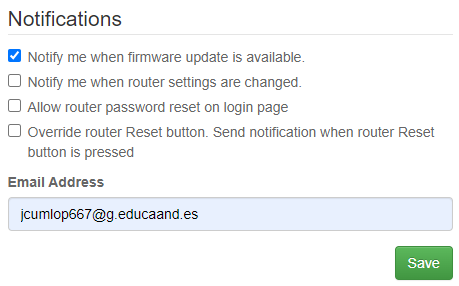

### Firmware auto-actualizable

Para evitar múltiples posibles incidentes de seguridad, un router nunca debería auto-actualizarse. Es por ello que desactivaremos esta opción en nuestro router pcWRT, de modo que accederemos a _Settings_, a System, y bajaremos hasta la sección _Flash New Firmware_, donde pincharemos en la opción de actualización manual. Además, si queremos mantener la configuración actual, podremos marcar la opción _Keep Settings_.

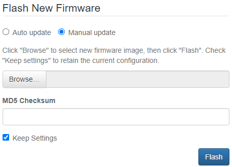

### Bloqueo de acceso al módem mediante IP

[...]

### Logging

[...]

### Email

[...]

### DDNS

[...]

### Monitoreo de dispositivos adjuntos

[...]

### Uso compartido de archivos de dispositivos de almacenamiento conectados a un puerto USB

[...]

### Acceso a la interfaz web

[...]

### Ocultamiento de SSID

[...]

### Falla de seguridad "Misfortune Cookie"

[...]

### Apps de Smartphone

[...]

### Notificación de dispositivo nuevo

[...]

### Dispositivos recientes

[...]

### Reseteo de fábrica

Si así lo deseamos, podemos resetear el router a su estado de fábrica, borrando todos los datos personales. Esta opción la encontramos en _Settings_, _System_, en la sección _Backup/Restore Settings_. Luego, tan sólo tendríamos que hacer clic en el botón _Restore Factory Default_.

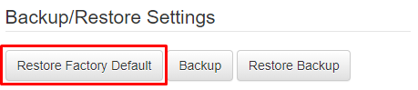

### HNAP

[...]
